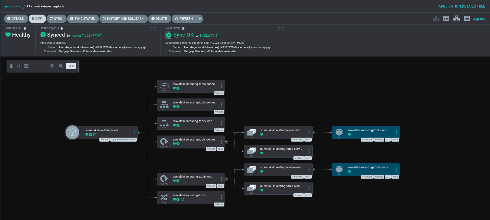

# suwalski-investing-tools

**What growth is today's price already paying for?** That is the question this toolkit
answers. You pin the growth you actually have a view on — "55% for the next three years" —
and it solves what the remaining years have to compound at for the intrinsic value to equal
the price on the screen.

```
GROWTH THE PRICE REQUIRES
  years 1-3    55.00%   your input
  years 4-10    4.76%   <- solved

  implied revenue CAGR over 10 years: 17.83%
  at that path intrinsic value is 224.03 against a 224.03 price
```

A normal DCF asks you to guess every year and hands back a valuation you tuned until you
liked it. This asks the opposite and hands back **one number to argue with**: is 4.76% for
years 4-10 plausible for this company, or not?

Same engine, three ways to reach it: `rdcf` in a terminal, a browser UI, and an HTTP API.

## What it does

- **Solves the growth the price requires.** Pin any year ranges you have an opinion on;
  every year you leave alone gets one shared rate, found by bisection to machine precision.
- **Fills in the facts for you.** Give it a ticker and price, share count, TTM revenue, TTM
  free cash flow and net debt are read off Yahoo Finance. Any of them can still be typed in
  by hand, and typed always wins.
- **Shows what the company actually reported.** Up to ten fiscal years of FCF margin and
  revenue growth, from SEC EDGAR, next to the assumptions you are setting — a 35% optimized
  margin reads differently beside a decade of 20%.
- **Keeps facts and opinions apart.** A provider supplies facts. Margin, growth, discount
  rate and terminal growth are yours, and nothing fetches them.

## What it is not

- **Not advice, and not a screener.** One company, one question. No portfolios, no ranking,
  no backtests, no alerts.
- **Not a forecast.** The solved rate is arithmetic about today's price, not a prediction.
- Dilution and buybacks are **not modelled** — the share count you pass is the one used for
  every year, so pass the count you expect to live with.
- Yahoo Finance is reached through `yfinance`, an **unofficial scraper**. It breaks
  occasionally; that is why every fetched value has a manual override.

## Requirements

**Nothing here is installed for you.** Only the first two are needed to run a valuation —
the rest unlock the parts of the repo you may never touch.

| What | Version | Needed for | Install |
| --- | --- | --- | --- |
| [uv](https://docs.astral.sh/uv/) | any | everything Python | `curl -LsSf https://astral.sh/uv/install.sh \| sh` |
| Python | 3.12-3.14 | everything Python | uv downloads it if you have none |
| [pnpm](https://pnpm.io/) + Node | Node 24 | the browser UI | `corepack enable pnpm` |
| podman + podman compose | any | the container stack | `sudo dnf install podman podman-compose` |
| jq | any | `scripts/infra/list.sh` | `sudo dnf install jq` |
| helm | 3.x | the chart check inside `test-solution.sh` | [helm.sh](https://helm.sh/docs/intro/install/) — skipped, with a note, when absent |

Built and tested on Fedora 44 with Python 3.14. CI runs the same script on Ubuntu.

## Install

```sh
git clone git@github.com:Manomenu/suwalski-investing-tools.git
cd suwalski-investing-tools
uv sync                  # one .venv at the root that knows all three Python packages
cp .env.example .env     # then set SEC_USER_AGENT — see below
```

The Python side is a single **uv workspace**: `uv sync` builds one environment for the
library, the server and the CLI together, and the root `uv.lock` is the only lockfile. The
`scripts/` entry points call `uv run`, so they keep that environment current on their own.

**Set `SEC_USER_AGENT` in `.env` to your own `Name email`.** SEC EDGAR asks automated
callers to identify themselves with a contact address, and refuses requests that do not
(and, oddly, refuses ones impersonating a browser). Left unset, the tool identifies itself
anonymously and EDGAR may throttle or refuse it — history then falls back to Yahoo's four
years instead of EDGAR's ten. The valuation itself is unaffected either way.

## Use it in the terminal

With a ticker, the observable facts are fetched and only the assumptions stay on the
command line:

```sh
./scripts/rdcf.sh --ticker MSFT --optimized-margin 30% --growth 1-5:12%
```

```
MSFT  price 495.63 USD  shares 7.43B  market cap 3.68T
  revenue TTM 331.84B   FCF TTM 66.99B (20.2%)   net debt -19.82B
  [yfinance, fetched just now]

YEAR    GROWTH  SOURCE         REVENUE   MARGIN            FCF             PV
-----------------------------------------------------------------------------
   1   12.00%  input          371.66B   30.0%        111.50B        101.36B
   ...
   6   21.05%  solved         707.90B   30.0%        212.37B        119.88B
```

Everything works with no ticker and no network at all — type the five numbers in yourself:

```sh
./scripts/rdcf.sh --price 224.03 --shares 24.40 --fcf 127.01 --fcf-margin 42% \
    --optimized-margin 35% --growth 1-3:55% --discount 10% --terminal 3%
```

`./scripts/rdcf.sh --help` prints every flag with what it means. The ones you will actually
reach for:

| Flag | Default | What it is |
| --- | --- | --- |
| `--optimized-margin` | *required* | The FCF margin you believe the business settles at. The biggest lever here, and a bet rather than a fact. |
| `--growth YEARS:RATE` | none | Growth you are asserting: `1-3:55%`, or `5:10%` for one year. Repeatable. Every uncovered year is solved. |
| `--discount` | `10%` | Your hurdle rate — the return you demand. Raise it and the same price implies more growth. |
| `--terminal` | `2.5%` | Growth forever after the last projected year. Must stay below `--discount`. Touch it least. |
| `--years` | `10` | How far out you are willing to forecast before the terminal value takes over. |
| `--ramp-years N` | `0` | Walk from today's margin to the optimized one over N years instead of applying it from year 1. |
| `--refresh` | off | Ignore the cached snapshot and refetch. |
| `--json` | off | Print the raw result instead of the tables. |

Rates take `55%` or `0.55` — **a bare number is always a decimal fraction**, so `55` means
5500%. Snapshots are cached for 15 minutes under `.artifacts/market/` (`--cache-ttl`
changes the window); reported history is cached for a week.

## Use it in the browser

```sh
./scripts/run/server.sh   # API on 6100
./scripts/run/web.sh      # UI on http://localhost:3000, proxying /api to the server
```

A left rail of tools and one open tool — no title bar, no chrome. Assumptions live in the
left panel; growth is either a single rate for the whole horizon or a split (near-term
years you pin, the rest solved). Every change re-solves, debounced, and the answer stays in
one place: input and solved sit in one card, separated by an arrow, with the solved figure
in a filled panel because it is the finding rather than another input.

The chart panel has three tabs — the projection, and two views of what the company actually
reported (FCF margin and revenue growth per fiscal year). The layout fills the viewport
rather than scrolling: the projection table pins its summary to the bottom while its rows
scroll, and at 21:9 (>= 2200px) it moves beside the chart instead of under it.

## Use it over HTTP

`./scripts/run/server.sh` — Swagger UI at <http://localhost:6100/docs>.

| Endpoint | What it gives you |
| --- | --- |
| `GET /market/{ticker}` | The observable facts for a symbol, plus reported history. `?refresh=true` skips the cache. |
| `POST /valuation/reverse-dcf` | The valuation itself. No network, no assumptions of its own. |
| `GET /health` | Liveness, for the container and the cluster. |

```sh
curl -s localhost:6100/market/NVDA | jq '{price, shares_outstanding, revenue_ttm, fcf_ttm}'

curl -s localhost:6100/valuation/reverse-dcf -H 'content-type: application/json' -d '{
  "revenue": 302.40, "optimized_fcf_margin": 0.35,
  "shares_outstanding": 24.40, "current_price": 224.03,
  "discount_rate": 0.10, "terminal_growth": 0.03, "projection_years": 10,
  "growth_segments": [{"start_year": 1, "end_year": 3, "growth": 0.55}]
}' | jq '.implied_growth'
```

Status codes: `422` the inputs parsed but the model cannot answer, `404` unknown ticker,
`502` the data provider failed — which is upstream of you, not your fault.

## The inputs

| Input | A ticker fills it? | What it means |
| --- | --- | --- |
| `revenue` | yes | TTM revenue — year 0, the base every growth rate compounds from. The CLI can also derive it from `--fcf / --fcf-margin`. |
| `current_price` | yes | Last traded price — the number the solver has to justify. |
| `shares_outstanding`, `net_debt` | yes | Enterprise value minus net debt, over shares, is what gets compared to the price. Negative net debt (net cash) adds. |
| `optimized_fcf_margin` | **no** | The FCF margin the business is expected to run at. Revenue times this margin is the cash being discounted. |
| `growth_segments` | **no** | The growth you are asserting, per year range. Everything else is solved. |
| `discount_rate`, `terminal_growth` | **no** | Your required return, and perpetuity growth after the projection. Terminal must stay below discount. |
| `current_fcf_margin`, `margin_ramp_years` | margin only | Optional: walk linearly from today's margin to the optimized one over N years. |

Units are free-form — billions, millions, dollars — as long as revenue, net debt and share
count use the same one. The math and a worked example against a published NVDA screen are
in [`docs/reverse-dcf.md`](docs/reverse-dcf.md).

## Where the numbers come from

Prices and TTM figures come from Yahoo Finance. Reported history comes from **SEC EDGAR's
XBRL API** first — free, official, no key, and as many years as the company filed — with
Yahoo as the fallback for markets EDGAR never sees. Sources are a list, not a fallback
chain: both are asked, and their years are merged.

| You look up | You get | Why |
| --- | --- | --- |
| US filers (`MSFT`, `KO`, `NVDA`) | up to 10 years, USD | EDGAR's `companyfacts`, the primary source |
| US-listed ADRs (`ASML`, `TSM`, `SE`, `GRAB`) | 4-10 years, in the currency they report | Foreign issuers file a 20-F; the `ifrs-full` taxonomy and non-USD reporting are both handled |
| Warsaw (`DNP.WA`, `CDR.WA`, `PKO.WA`) | 4 years, PLN, via Yahoo | GPW companies are not in EDGAR at all, and there is no free, licence-clean API with a decade of their fundamentals |

Two details that make this usable rather than merely available: **the cache accumulates
years** — EDGAR has no "give me years 4-8" endpoint, so widening the horizon later costs
nothing and years survive their source — and **only the continuous tail is charted**,
because XBRL tags drift and a gap in the middle of a history chart reads like a collapse.

One thing the model cannot know: **the discount rate is yours to set per currency.** 10% is
a reasonable hurdle in USD; for a PLN-denominated business both it and the terminal growth
carry higher local inflation.

## Run it in containers

The two deployables as the cluster runs them — the server as a wheel on a slim Python base,
the web build as static files behind nginx:

```sh
./scripts/infra/up.sh         # http://localhost:8080
./scripts/infra/list.sh       # what is up, on which ports
./scripts/infra/down.sh       # stop it
```

`up.sh --rebuild` ignores the layer cache and builds both images from zero — for when you
suspect a stale layer rather than a stale source file.

Only `web` publishes a port: the browser talks to one origin and nginx proxies `/api` on to
the server, stripping the prefix. Machine-local settings come from the root `.env`; in the
cluster they arrive as a Secret instead. Neither image runs as root, and neither holds
state — the snapshot cache is scratch, so the server scales out with no volume attached.

## Deployed by GitOps

For Kubernetes there is a Helm chart under [`deploy/chart/`](deploy/chart). Nothing here
runs `kubectl`: [Argo CD](https://argo-cd.readthedocs.io/) watches a separate platform repo
and reconciles the cluster to match it. CI lints and tests every change and pushes both
images to GHCR from `master`; the platform repo pins which tag is live, which is why
`image.tag` is deliberately empty in this chart.



The tree above is what one deployment looks like from Argo's side. Two ReplicaSets per
Deployment is normal: the older one is kept at zero replicas so a rollback costs seconds
instead of a rebuild.

## When something looks wrong

The CLI says what happened on stderr and exits with a code you can branch on:

| Exit | You will see | What it means |
| --- | --- | --- |
| `1` | `cannot solve: even at 300.0% growth ...` | No growth inside the bracket justifies the price. The price is being explained by the margin, the discount rate or the terminal assumption — not by growth. Widen with `--max-growth` if you believe the higher rate. |
| `2` | `invalid inputs: ...` | Bad or missing arguments, or a combination the model rejects — `terminal_growth must stay below discount_rate` is the usual one. |
| `3` | `market data: Yahoo Finance has no financial statements for ...` | The lookup failed: wrong symbol, or the provider is having a bad day. Pass the numbers by hand. |

| Other symptom | What to do |
| --- | --- |
| History charts show four years for a US company | `SEC_USER_AGENT` is unset or not exported into the environment — EDGAR turned the anonymous request away and Yahoo answered instead |
| An ADR resolves to no history at all | EDGAR lists no ticker for some ADRs; map it explicitly with `SEC_CIK_OVERRIDES=SE:1703399` |
| The UI loads but every request fails | The server is not up, or is on another port — `./scripts/run/server.sh`, and check `CORS_ORIGINS` |
| A stale figure after a price move | `--refresh` on the CLI, `?refresh=true` on the API — snapshots live 15 minutes |

## Layout

| Path | What it is |
| --- | --- |
| `suwalski_investing_library/` | The valuation engine, the pydantic contracts, and `marketdata/`. The engine half is stdlib + pydantic only — importing it pulls in no scraper, and a test enforces that. |
| `suwalski_investing_server/` | FastAPI over the engine. Port 6100. |
| `suwalski_investing_cli/` | `rdcf` — the same engine in the terminal. |
| `suwalski_investing_web/` | React 19 + Vite + Tailwind 4, Catppuccin Mocha. A static build; no Node server to deploy. Port 3000 in dev. |
| `scripts/` | Entry points: `run/`, `infra/`, plus the CLI, lint+test and cleanup. |
| `deploy/chart/` | The Helm chart. |
| `docs/` | [`reverse-dcf.md`](docs/reverse-dcf.md) (the model and its math), [`guidelines.md`](docs/guidelines.md) (repo rules), `guide/` (how the deployment was built, and why — in Polish). |
| `.artifacts/` | Local scratch: cached snapshots and history. Gitignored. |

## Working on it

One gate before any commit — ruff, every test suite, the web typecheck and the chart:

```sh
./scripts/test-solution.sh
```

CI runs that same script, deliberately: CI that runs something else is CI that can disagree
with your machine, and then neither of you is trustworthy.

Clean up after yourself:

```sh
./scripts/cleanup.sh                  # caches and generated files inside the repo
./scripts/cleanup.sh --all --dry-run  # everything, including traces outside it — shows, deletes nothing
```

`--venvs` drops `.venv` and `node_modules` (`uv sync` and `pnpm install` rebuild them);
`--system` removes what lands outside the repo — pytest's `/tmp` directories, yfinance's
timezone cache, this repo's VS Code workspace storage, and, after asking, a prune of the
shared uv cache. Nothing under `/var` is touched, because nothing of ours goes there.

In VS Code, open the repo folder — the single workspace `.venv` is what every debug
configuration points at, so breakpoints resolve without interpreter switching. `Run server`,
`rdcf: ask for arguments` and `pytest: all projects` are in the Run panel, and
`test-solution` is the default test task (Ctrl+Shift+P → Run Test Task).

## Roadmap

- **More providers.** `yfinance` is an unofficial scraper; a keyed provider (FMP, Tiingo)
  slots in behind the same `TickerSnapshot` contract when it starts breaking.
- **More tools.** The web shell takes a new tool as one entry in `src/tools.ts` plus its
  component; the reverse DCF is simply the first one.

## License

MIT — see [LICENSE](LICENSE). Do what you like with the code.

The data is a separate question, and the licence does not cover it. **SEC EDGAR** filings
are public domain; use them freely, and keep `SEC_USER_AGENT` set so the fair-access policy
is satisfied. **Yahoo Finance** data arrives through `yfinance`, an unofficial scraper, and
Yahoo's terms restrict it to personal, non-commercial use — a commercial deployment needs a
provider whose terms allow it. Dependency licences, and the font notices that ship with the
web build, are in [THIRD-PARTY-NOTICES.md](THIRD-PARTY-NOTICES.md).
